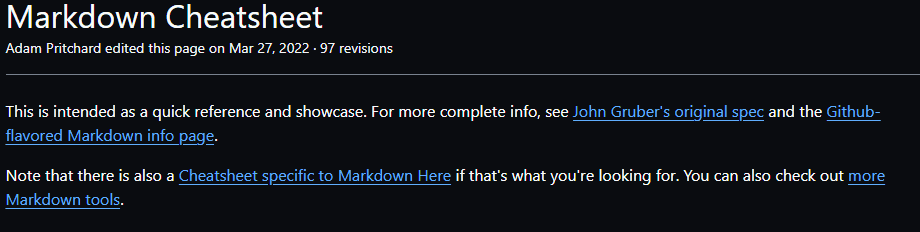

# Projeto com README
Um projeto de teste com um arquivo README 🚀

[](https://github.com/adam-p/markdown-here/wiki/Markdown-Cheatsheet)

## Tecnoligias utilizadas
- HTML
- CSS
- JS

## Como utilizar

1 - Clone o projeto
```
git clone <url>
```
2 - Acesse a pasta do projeto
```
cd repositorio-com-readme
```
